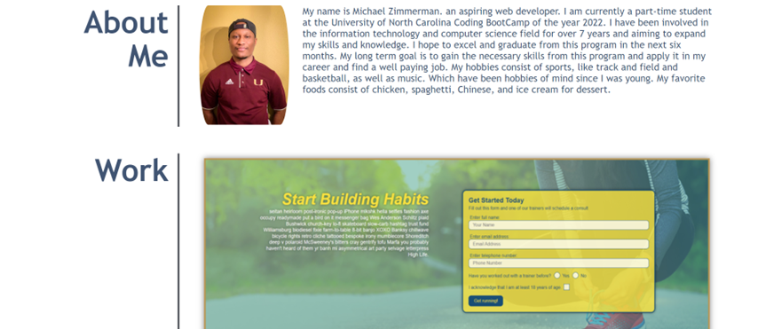
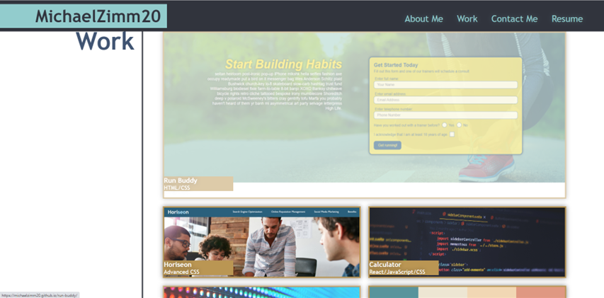
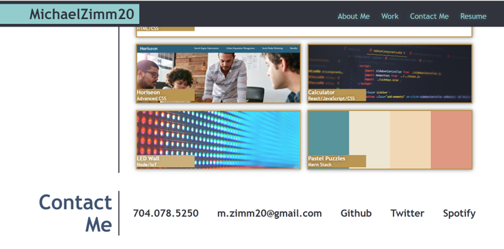

# My Professional Portfolio


## User Story 
```
AS AN employer 
I WANT to view a potential employee's developed portfolio of work samples.
So that I can review samples of their work and assess whether they're good candidate for an open position.
```


## Acceptance Criteria 

```
GIVEN I need to sample a potential employee's previous work
WHEN I load their portfolio
THEN I am presented with the developer's name, a recent photo or avatar, and links to sections about them, their work, and how to contact them
WHEN I click one of the links in the navigation
THEN the UI scrolls to the corresponding section
WHEN I click on the link to the section about their work
THEN the UI scrolls to a section with titled images of the developer's applications
WHEN I am presented with the developer's first application
THEN that application's image should be larger in size than the others
WHEN I click on the images of the applications
THEN I am taken to that deployed application
WHEN I resize the page or view the site on various screens and devices
THEN I am presented with a responsive layout that adapts to my viewport
```


## My Criteria 

* Develop a professional portfolio highlighting my latest projects, with sematics, flex properites, resposive layouts with media queries, and logical structure.


## Consist of 
```
* Semantic Elements to for structure and ease of reading the code.

* Use of flex properties to align parent and children elements.

* Clickable images that are deployable to respective application.

* Responsive Designs, CSS variables, Pseduo-classes, and Flexbox 

* <a> links to access different areas of the page or other site

* Standard accessbility semantics
```


## Important Links

* Github Link:  https://github.com/MichaelZimm20/my-professional-portfolio.git

* Deployable Live Link:  https://michaelzimm20.github.io/my-professional-portfolio/


## Screenshots

 
<br/><br/><br/><br/><br/>


<br/><br/><br/><br/>

 
<br/><br/><br/><br/>

 
<br/><br/><br/><br/>

 
<br/><br/><br/><br/>
